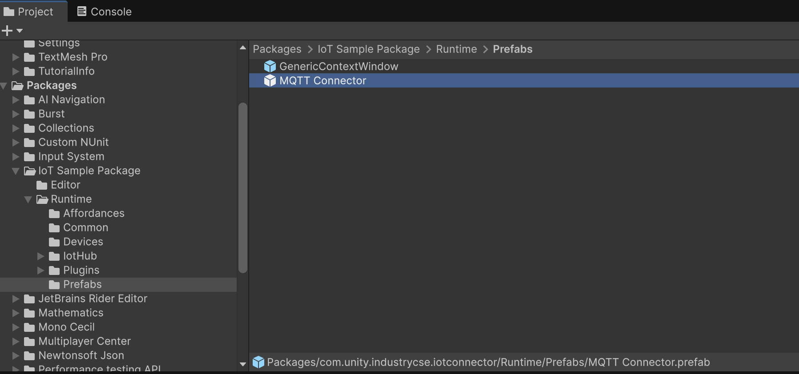
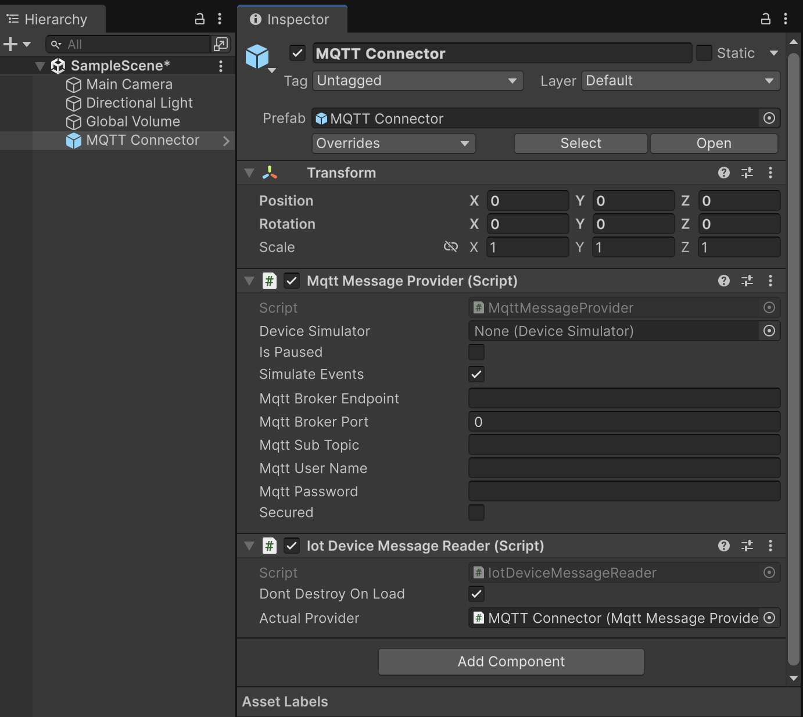
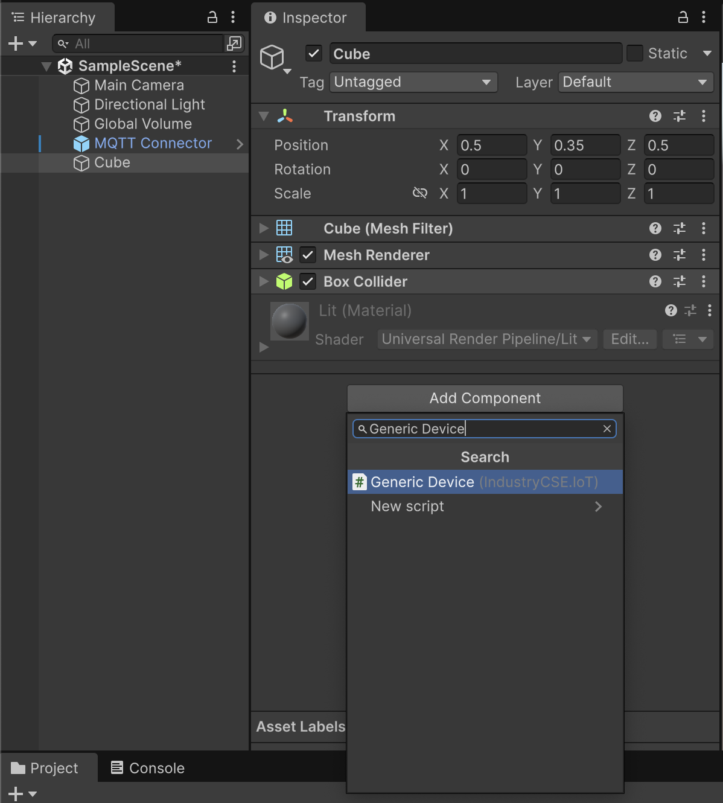
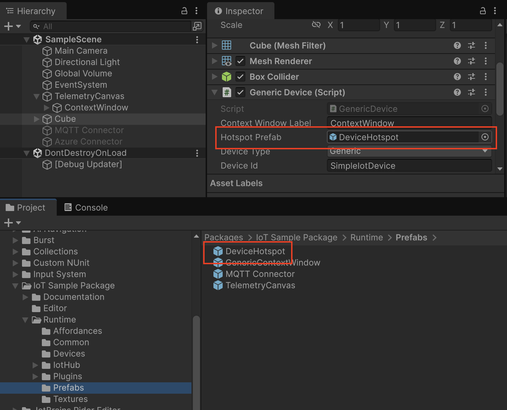
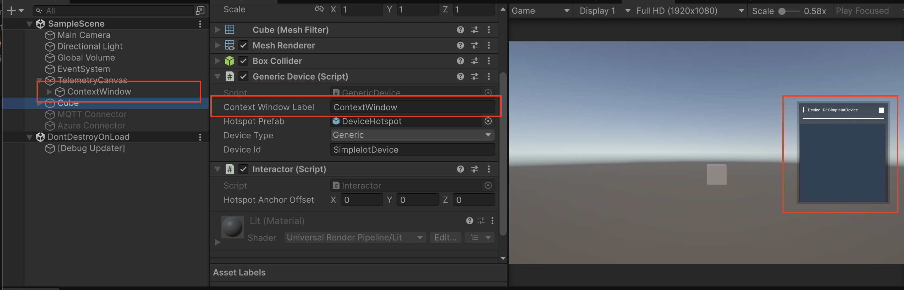
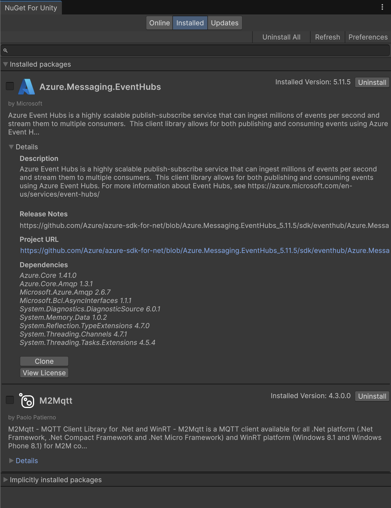
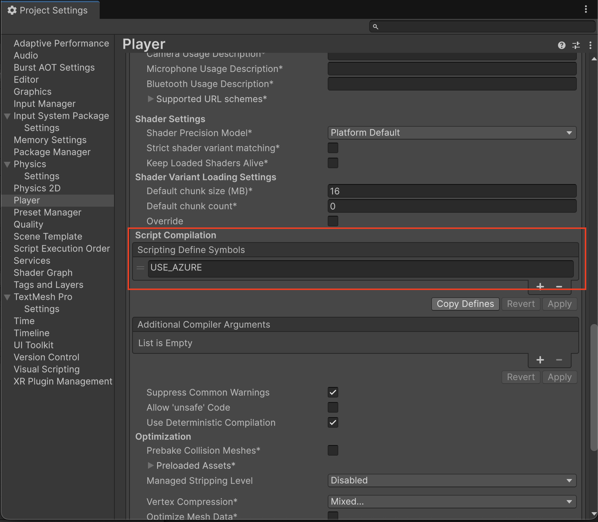
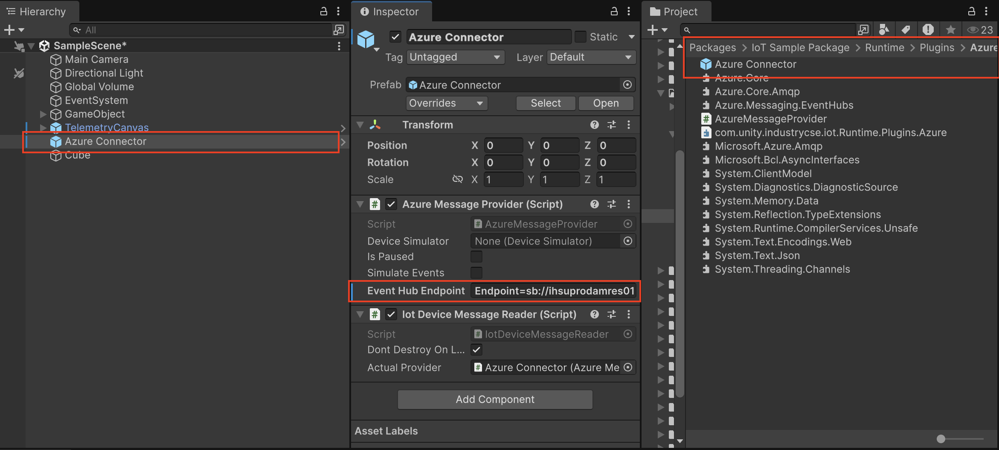

# IoT Sample Package

This package is designed to streamline the integration of IoT devices within Unity by providing a modular framework for connecting Unity GameObjects to external data sources such as IoT telemetry data. It abstracts the complexities involved in receiving, handling, and visualizing telemetry data from multiple external systems, allowing developers to focus on the core logic and user experience of their applications rather than on connectivity concerns.

The package supports MQTT communication through integration with the open-source M2MQTT library, enabling bi-directional communication with MQTT brokers. It also provides native support for Azure IoT Hub using Microsoft Azure SDKs. The architecture is extensible, making it easy for developers to add support for additional IoT protocols or custom REST APIs through a simple plugin interface.

By abstracting the communication logic and providing a plugin system for third-party extensions, the package eliminates the need for developers to implement low-level IoT communication and message distribution themselves. This allows developers to accelerate their development process and concentrate on creating engaging, interactive, and data-driven IoT experiences within Unity.

## IoT Sample Package Installation Guide

This guide will walk you through setting up an IoT Device that can receive messages from an MQTT Broker or Azure EventHub.

### Getting Started

Quickly set up an MQTT connection and integrate an IoT device in your Unity scene.

#### Add the MQTT Connector

1. In the **Project** tab, find the package folder.
2. Drag the **MQTT Connector** prefab into your scene.
3. In the **Inspector**, enter your MQTT broker details in the MQTT Connector prefab.

**Example Broker:**
- **Host:** `localhost`
- **Port:** `1883`
- **Topic:** `devices/updates`

#### Create an IoT Device

Any GameObject in your scene can be set up as an IoT device to receive messages.

1. Create a new GameObject in your scene.
2. Add the **GenericDevice** component to the GameObject.  
   This component provides a basic hotspot for displaying incoming telemetry data in a generic UI window.
3. Set the **Device Id** in the GenericDevice component to match the IoT device id that will send messages to Unity.

#### Add the Hotspot

You can assign a hotspot element to the Iot device to handle user input and to expose telemetry data.

1. Find the newly created Iot device and the **GenericDevice** component in your scene
2. Add the **DeviceHotspot** prefab from the `IoTSamplePackage/Runtime/Prefabs` folder to the `Hotspot Prefab` entry of the **GenericDevice** component.

#### Add Context UI

1. Add the **TelemetryCanvas** prefab from the `IoTSamplePackage/Runtime/Prefabs` folder to your scene.
2. Adjust the position of the **GenericContextWindow** as desired.
5. Once positioned, disable the **GenericContextWindow** prefab to hide it initially. It will be shown when the hotspot is clicked.
6. In the **GenericDevice** component on your IoT GameObject, set the window name to the name of the context window prefab you just added.
7. Add a **EventSystem** object to the scene using **Create > Assets > UI > EventSystem**

### Testing Your IoT Device

That’s it! You have successfully created and set up an IoT device in Unity.

Click **Play** in the Unity Editor to start receiving telemetry messages from your IoT system.

## Adding Plugins

The IoT Sample Package provides built-in support for MQTT communication via the open-source M2MQTT library, as well as integration with Azure IoT Hub. These libraries can be easily added to your Unity project using the NuGet Package Manager (NuGet Unity Package Manager).

For convenience, both the M2MQTT and Azure Messaging EventHubs libraries are also included in the Plugins folder of the package.

In addition to these defaults, the IoT Sample Package supports third-party MQTT integrations, such as the BestMQTT and RocWorks assets. These alternatives are especially useful in scenarios where the default M2MQTT library does not meet requirements, such as in WebGL applications.

By default, the sample package uses the M2MQTT library for MQTT communication. To enable Azure IoT Hub or other plugins, you can use conditional compilation flags in your project settings.

To enable Microsoft Azure integration, navigate to **Project Settings > Player > Scripting Define Symbols** and add **USE_AZURE** to include the Azure library in your build.

Once the Azure flag is set, you can select the Azure Connector prefab from the IoT Sample Package, located under **Runtime > Plugins > Azure**.

The Azure connector implementation connects to the Azure IoT Event Hub endpoint to receive IoT device status updates and telemetry information in real time.

